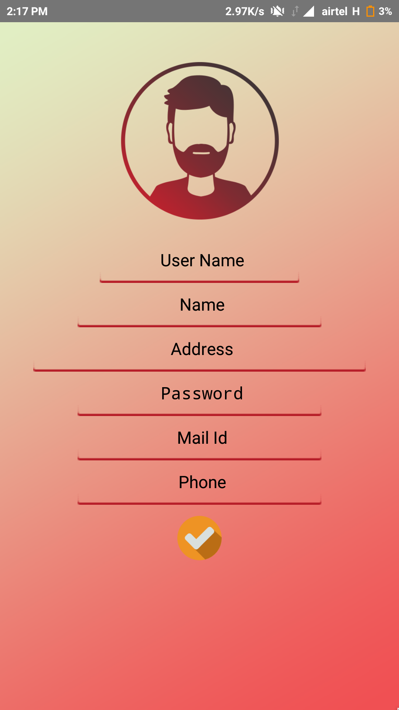
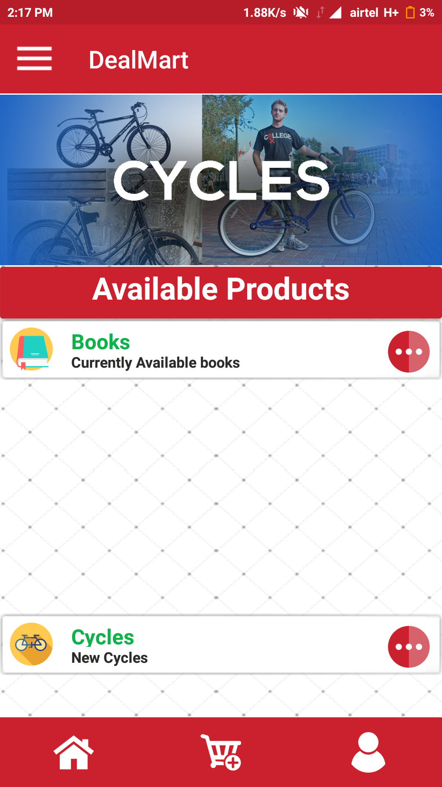
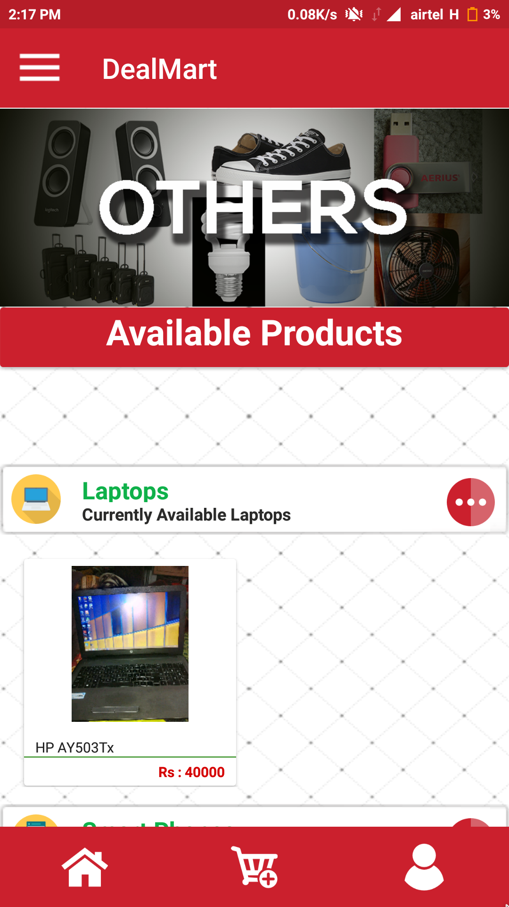

# D-Mart
An ecommerce android app that helps the user to buy and sell their old goods and helps the user to view the products that has been sold by other users.

A user can also send a notificaiton in order to buy the desired product.
<h2>Screen shots</h2>

<h2>Installation</h2>

Clone the project from github. Extract the file and import it in Android Studio.Compile it and Run

<progress value="99" max="100">
</progress>

<h2>Contributers</h2>

Vikash Kumar Yadav

E-Mail=yadavikas25071997@gmail.com

Barun Sarraf

E-Mail=barunsaraf1@gmail.com

